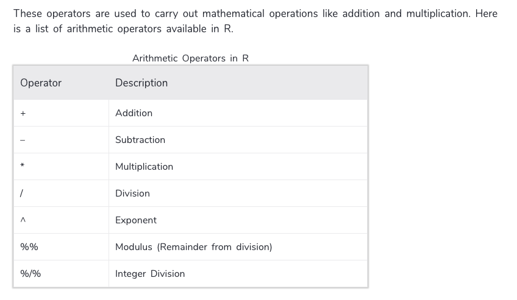

\newpage

Many people have contributed to developing and revising the tutorial material over the years: 

Anna Khazenzon 
Cayce Hook
Paul Thibodeau
Mike Frank
Benoit Monin
Ewart Thomas
Michael Waskom
Steph Gagnon 
Dan Birman
Natalia Velez,
Kara Weisman
Andrew Lampinen
Joshua Morris
Yochai Shavit
Jackie Schwartz
Russ Poldrack

\newpage

# Basic interaction with the R console  

## R as calculator  

You can treat R like a calculator for basic computations.   
Just type some mathematical expression into the bottom pane--the   
console--next to the `>` symbol, and hit enter.   
The result will be displayed on the following line.  
In an .rmd file (like this one) lines of code typically   
appear within ___"chunks"___- grey boxes that typically  
correspond to one "large" thing you are trying to do   
(e.g- "clean data" or "Test hypothesis 1").   
You can enter "comments" (lines of text expalining to yourself/  
other people who might see your code what's going on)   
by starting a line with a hashtag ("#").   
The line will then be colored green and R will treat  
whatever comes after it as a text.   
It is highly recommended to comment on your code often. 

```{r basic_calculator}
# Run the lines of code below- 
# Do this with every chunk of code in this tutorial, and try to predict 
# what the result of running this line of code will be before hand.
1 + 2
13 / 2
2 ^ 6
5 * (2 + 3)
```

## Where do the numbers go?

When you evaluate an expression like `1 + 2` in the console,  
the result is displayed on the screen but doesn't get saved anywhere--  
just like on an ordinary calculator.   
Of course, R is a programming language,  
so it is much more powerful than a basic calculator.   
A major aspect of computing with R involves the   
assignment of values to *variables.*  

Use the chunk below to practice using R as a calculator 

```{r basic_calculator practice}
# Write a mathematical expression with at least three numbers

# Write a mathematical expression with different operations

```


# Variable assignment

There are two (almost) equivalent ways to assign a value to a variable,  
using `=` and `<-`:

```{r variable_assignment_1}
cohort_size = 11
cohort_size <- 11


#NOTE: It is important not to confuse variable assignment   
# with a statement about equality.  
# In your head, you should say "set cohort_size to 11" or   
# perhaps "cohort_size gets 11", but not "cohort_size is equal to 11". 

# Although using `=` to assign variables is the norm in many other   
# programming languages, the standard in R is to use `<-`* for 
# variable assignment as it makes the action that is being
# performed more obvious. 
```


As you work on an R session you will produce a collection of "objects"   
held in the computer's memory (or for the purposes of R, your "workspace").   
Check the top-right pane in RStudio under 'environment' to view the objects   
that are currently stored in your workspace.  


You should see `cohort_size` is now one of these objects the computer is   
keeping track of, and its value is `11`.    
It will remain stored as `11` unless and until you reassign `cohort_size`. 


```{r variable_assignment_2}
cohort_size # prints the current value of cohort_size
cohort_size + 2 
```

What value is `cohort_size` set to now? After running these two lines of code,   
type `cohort_size` into the console and hit enter. 

Even though we added 2 to it, `cohort_size` is still set to 11,   
because we didn't reassign its value. 

Let's do that next:

## Reassignment

```{r reassign}
cohort_size <- cohort_size + 2


cohort_size
```

```{r practice variable assignment, eval=FALSE}
# CHECK YOUR UNDERSTANDING: 

# What value is `a` set to after running each line of this code?
# What value is `b` set to after running each line?

a <- 2 
b <- 2

a + 2
a + 2
a + 2
a + 2


b <- b + 2
b <- b + 2
b <- b + 2
b <- b + 2


# Answer: 
# `a` remains 2,2,2,2,2; `b` changes from 2 to 4, 6, 8 and finally 10.
```

We can keep reassigning the value of a variable to anything we want:

```{r reassign2}
cohort_size <- 208198.4
cohort_size
```


## Naming variables 

When writing code to perform analysis, you should use descriptive names.   
Code where things are named, `subject_id`, `condition`, and `rt` will   
make **much** more sense than 'v1', 'v2', and 'v3' when you read  
it again 4 months later as you write up the paper.

There are a few additional rules for variable names. 

The first character must be a letter. You can't use spaces. **Case matters!**  

```{r case_matters}
a <- 10
A <- 12
a == A

subid <- 13
subID <- 26
subID == subid

cohort_size = "average"
```

\newpage

R can be picky. 
For instance, failing to put quotation marks around a   
string will break your code. (Try typing `cohort_size == average` in  
the console). 
Why do you think it doesn't work?


\newpage
 
(In this case, R thinks you're talking about a different object called   
`average`, and throws an error since you haven't defined any such object.)


Now try `Cohort_size == "average"`). What's wrong here?

\newpage

(In this case, R looks for an object named `Cohort_size`,   
but of course from R's point of view, only `cohort_size` exists.  
Small typos like this can cause a lot of frustration, so keep an eye out!)

\newpage

When you want something like a phrase in your variable name,   
you can use `_` and `.` but not `-`  
Whatever you choose, it's best to be clear and consistent.

```{r consistency}
# GOOD:
barack_age <- 57
michelle_age <- 54

# NOT SO GOOD:
ObamaAge=57
michelle.Age<-54

```


Again, you could make all of these variable assignments with `=`,  
but we encourage you to use `<-`.   

# Data Types

So far we've only been dealing with numbers,  
but there are other data types as well.


For instance, we could assign character (aka string) values,  
with quotation marks:

```{r reassign_string}
cohort_size <- "average"
cohort_size

my_name <- "Leili"

stanford_phone <- "6507232300" 

```

We can also assign logical values, TRUE and FALSE:

```{r reassign_logical}
alive <- TRUE
asleep <- FALSE
```

 
As you see, there are several types of data.
Generally speaking:
- Numbers
- Strings or characters (i.e., letters, numbers, symbols, etc.)
- Logical (i.e., TRUE pr FALSE)
- Lists
- Tables or matrices
- Figures
- etc.

Technically speaking, R has a variety of data types.
We'll get to know some of the important ones as we go on.


When assigning a variable, R automatically tries to detect variable types, 
but you can also specify and change them.

```{r checking variable types}
x <- 2
class(x)

word <- "hello"
class(word)
```


```{r changing variable types}
# now let's change x from numeric to character
x <- as.character(x)
class(x)

# or we could also save a number as character just by putting it in quotation:
y <- "2"
class(y)
```

 
Why does it matter?

Let's see:

```{r operators on numbers and characters}
x <- 2
x*2

y <- "2"
# y*2

# in this case, R doesn't know how to multiply a character string
# just as it wouldn't be able to multiply a word
# so it returns as error: "Error in y * 2 : non-numeric argument to binary operator"
```

As you see, variable types matter when you want to manipulate them 
with operators and functions.


# Operators

## Relational operators

In case you're wondering, you test for equality with two equal signs (`==`),   
which you should read as ('is equal to').   
It does something completely different than `=`:

```{r equality_tests}
2 == 2
2 == 3

cohort_size == "average"
cohort_size == "small"
```

(While we're at it, you can also compare numbers with `>`, `<`, `!=`, `<=`,   
and `>=`, which return TRUE or FALSE as well). 

```{r comparison_tests}
2 < 3
3 <= 3
3 != 4 #-> note: the sign "!=" means "not equal to"
```

 


```{r practice relational operators, eval = FALSE}
# APPLY YOUR KNOWLEDGE:
# Can you explain what's happening at each line of code below?

a <- 10
b <- 20
a <- b
print(a)

a <- "b"
print(a)

a <- 10
a < b


# `a` is set to 10, 
# `b` is set to 20, 
# `a` is set to the value of `b` (or "`a` gets `b`"), 
# we print the value of `a` (which is now 20). 

# `a` is set to "b" (the character),
# we print the value of `a` (which is now "b").

# `a` is set to 10 again.
# the computer evaluates the statement `a < b` (that is, 10 < 20), and returns 
# the logical value TRUE. (TRUE isn't saved anywhere, though --
# it's just printed in the console.)

```


## Arithmetic operators

The same as before when we were using R as a calculator, now that 
we know how to assign variables, we can do arithmetic calculations
on variables:

```{r calculate_with_variables}
# First, assign values to variables:
devo <- 1
affective <- 4
cog <- 1
social <- 4
neuro <- 1


cohort_size = devo + affective + cog + social + neuro 
cohort_size # print the result


# Of course, we can do completely arbitrary calculations with any
# of our variables too--R will oblige:
apples <- (social * 
             (cog - neuro)^3 +
             social * devo + 
             cohort_size + 12) / 
  (cog - affective)
oranges <- -(3^2)

apples == oranges 
```

 


## Logical operators

Logical operators are used to carry out Boolean operations like AND and OR.
They return TRUE or FALSE

```{r logical operator}
a <- 2
b <- 3
c <- 3

c == a | b

# we'll show you an example of `&` when we work with vectors.
```

---------------------------

# Functions

We can use *functions* to perform more complex operations.  
Functions specify a transformation from one or more inputs  
(called *arguments* or *parameters*) to   
one or more outputs (or *return values*). 

You *call* a function by writing its name followed by parentheses,  
with any arguments going inside the parentheses.   
There are some basic mathematical functions built into R that operate on numbers:

## Math functions

```{r math_functions}
abs(-4) # absolute value
sqrt(64) # square root
log(1.75) # natural log
```

## Concatenate `c()`

Let's look at the function `c()`, which stands for *concatenate*.   
This takes a sequence of arguments and sticks them together into a *vector*.   
Vectors are immensely useful- most of the built-in functions for   
descriptive statistics (and there are many of these!) expect to   
receive a vector or something like it

```{r basic_vectors}
# Create vectors for the forecasted high temperatures for San Francisco 
# and Palo Alto over the next week:
paloalto_highs <- c(73, 81, 88, 84, 79, 75, 74)
sf_highs <- c(70, 75, 85, 79, 72, 67, 71)

paloalto_highs
sf_highs
```

## Functions for descriptive stats
Now we can do things like take the mean, with--you guessed it--`mean()`,  
and standard deviation with `sd()`. We could also look at each vector's    
`length()`, its `max()` or `min()` values, or its `median()` or `range()`. 

```{r mean_sd}
mean_sf <- mean(sf_highs)
sd(sf_highs)

mean_pa <- mean(paloalto_highs)
sd(paloalto_highs)


# APPLY YOUR KNOWLEDGE:
# 1) Find the median and range for these vectors.
# 2) Find the length of the vectors. What does the length refer to? 
# 3) On average, by how many degrees will Palo Alto be warmer 
# than SF over the next week?


# Answers:

# 1) SF median = 72, range = (67, 85); PA median = 79, range = (73, 88)

# 2) Length is 7; there are 7 entries in each vector

# 3) mean_pa - mean_sf = 5
```

# On missing data 

Functions can have multiple arguments. Sometimes, functions have  
optional arguments that come with default values. When values are  
not passed for these arguments, they take the default value,  
which can be found when you look at the help for that function.  

Pull up the help document for `mean()` by entering `?mean` in the console. 

Most statistical functions in R, including `mean()`, have built-in  
missing-value handling. Because missing data is common with real-world data,   
there is a special object in R to stand for it called `NA`.   
Functions like `mean` have an optional argument `na.rm`    
which tells the function whether it should just ignore these values.   
(`rm` stands for "remove", just like in the terminal.) 

`na.rm` is set to `FALSE` by default, so a vector with missing values   
will have a mean of NA (to indicate that the normal mathematical procedure   
failed on these particular data):

```{r na.rm_false}
a <- c(2, 6, NA, 8)
mean(a)
```

 
However, you can handle the missing data by setting `na.rm` to `TRUE`,  
which omits any `NA` items from the calculation.

```{r na.rm_true}
mean(a, na.rm = TRUE)

```

**NOTE**: remember to use `na.rm = TRUE` almost all the time.
It will save you a lot of time and frustration when you can't 
figure out why a simple `mean()` function doesn't work (i.e., 
returns NA values when there are clearly numbers in your data).

---------------------------

# Vectors

We've just been using one of the most basic data structures, which is   
called a *vector*. Vectors are an ordered group of elements with a  
single dimension. All of the values have to be the same data type   
(i.e., numeric, character, or logical), or R will coerce them to have
the same data type.

You get a vector when you use the `c()` function:

```{r c_vector}
vector <- c(1, 2, 3, 4)

# coercion into the same datatype
v <- c(1, 2, TRUE, "a")
class(v)
v
```
  

```{r sequences}

c(1, 2, 3, 4, 5, 6)

# DIGRESSION: There are other ways to get an equivalent sequence. 
# You can use the `:` operator:
1:6

# You can also use the function seq():
seq(1,6)
```

# Applying functions to vectors

You can apply mathematical expressions to entire vectors.

For instance, we can calculate how many degrees hotter Palo Alto  
will be on each day of the following week:

```{r vectorized_math}

temp_difference <- paloalto_highs - sf_highs
temp_difference

# CHECK YOUR KNOWLEDGE:
# Do you understand what happened here? How was each entry in 
# `temp_difference` calculated?


# (The first entry in `sf_highs` was subtracted from the first entry in
# `paloalto_highs`, and this value stored in the first entry in 
# `temp_difference`, and this was repeated for each of 
# the remaining entries in the vector)


# APPLY YOUR KNOWLEDGE. 
# The formula for translating degrees  
# F to C is celsius = (fahrenheit - 32) * (5/9)
# Write a line of code that applies this formula to paloalto_highs, 
# and store the result in a new variable called paloalto_highs_c.


# Answer: paloalto_highs_c <- (paloalto_highs - 32) * (5/9)

```


# Indexing

Sometimes it's useful to pull specific elements out of a vector.   
To do this, you *index* by writing the name of the vector and   
then adding square brackets (`[ ]`)  with the position of the  
item you want (starting at 1). 

```{r index_vector}
snacks <- c("cookies", 
            "ice cream",
            "cake",
            "chocolate bar",
            "gummy worms",
            "key lime pie")
snacks[3]
```

You can also use `:` or `c()` to index multiple elements:
```{r index_vector2}
snacks[3:5]
snacks[c(1,6,4)]
```


And finally, you can use brackets with logical statements to find  
a subset of your vector:

```{r relational index}
paloalto_highs[paloalto_highs < 80] 
# this will return all the entries in `paloalto_highs` where the value 
# is less than 80

# remember we said we'll show an example of `&` as a logical operator?
# Here's one:
paloalto_highs[paloalto_highs < 80 & paloalto_highs > 77] 

```

```{r practice indexing}
# APPLY YOUR KNOWLEDGE:
# Using brackets and the function `length()`, write a line of code
# that returns a vector containing all of the days next week in which
# Palo Alto will reach at least 80 degrees F. 


# Answer: paloalto_highs[paloalto_highs > 80]

```


---------------------------
